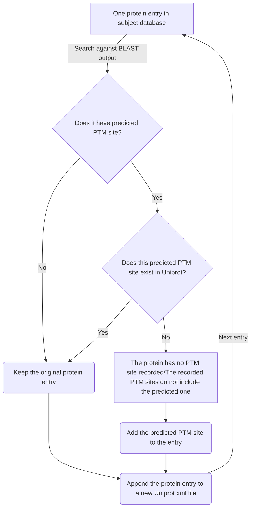

# The logic of PTM prediction
The prediction is achieved through three main sections, and all of them are integrated in one python script. 
The instruction of running the application is described in the front page and of preparing inputs is described in **Example** folder

**Note**: All inputs and scripts should be stored in the same folder.

## 1. Generating short sequences
In this section, the protein sequences in the query xml file will be parsed and splitted into multiple short sequences in which the center amino acid is a site for at least one type of PTMs. These short sequences will be stored as a fasta file. The logic of this section is depicted as below:

[](https://mermaid-js.github.io/mermaid-live-editor/#/edit/eyJjb2RlIjoiZ3JhcGggVERcbkFbT25lIFBUTSBzaXRlXSAtLT5Ce1doZXJlIGlzIGl0J3MgcG9zaXRpb24gaW4gc2VxdWVuY2U_fVxuQiAtLT4gfENsb3NlIHRvIEMgdGVybWludXN8QyhlLmcuICdNJ0VGVFJIQUtMUEQuLi4pXG5CIC0tPiB8SW4gdGhlIG1pZGRsZXxEKGUuZy4gLi4uWVRSU1cnSydMR1RTQS4uLilcbkIgLS0-IHxDbG9zZSB0byBOIHRlcm1pbnVzfEUoZS5nLiAuLi5SRURSVFNLJ04nTUQpXG5DIC0tPiB8RXh0cmFjdHxGW0FkZCB0aGUgc2hvcnQgc2VxdWVuY2UgaW4gYSBmYXN0YSBmaWxlXVxuRCAtLT4gfEV4dHJhY3R8RlxuRSAtLT4gfEV4dHJhY3R8RlxuRiAtLT4gfE5leHQgUFRNIHNpdGV8QSIsIm1lcm1haWQiOnsidGhlbWUiOiJuZXV0cmFsIn0sInVwZGF0ZUVkaXRvciI6ZmFsc2V9)

## 2. Running local BLAST
Each sequence in the newly generated fasta file will BLAST against the subject proteome. Currently the default searching parameters are used and the scoring matrix is fixed to PAM30 which is optimal for short sequence BLAST. The search result will be separated into two parts. The first part contains a series of alignment files for the short sequences that pass the **e-value** threshold during BLAST. The second part will be BLAST result summarized in a csv datasheet. The example of the datasheet is shown below:
Query_Accession_Number|Sbjct_Accession_Number|E_value|Match_Score|Query_sequence|Sbjct_sequence|Query_PTM_aa|Query_PTM_position|Query_start|Query_end|Sbjct_PTM_aa|Sbjct_PTM_position
----------------------|---------------------|-------|-----------|--------------|--------------|------------|------------------|-----------|---------|------------|------------------
 P17445 |  A0A1E3MAP0  | 4.21E-17 |  156   |	MANFFSSGQVCTNGTRVFVP | MANFFSSGQVCTNGTRVFVP | C | 11 | 1 | 20 | C | 286 |

The flowchart below depicts logic in this section:

## 3. Updating Uniprot xml
Every protein that has predicted PTM sites will be compared to a dictionary containing manually curated PTM sites. If one protein has predicted PTM sites that are not recorded in Uniprot database, these PTM sites will be assigned to that protein as a new element in xml file. Otherwise, the information of the protein will remain the same.

The logic is also summarized as below:

[](https://mermaid-js.github.io/mermaid-live-editor/#/edit/eyJjb2RlIjoiZ3JhcGggVERcbiAgICBBW09uZSBwcm90ZWluIGVudHJ5IGluIHN1YmplY3QgZGF0YWJhc2VdIC0tPiB8U2VhcmNoIGFnYWluc3QgQkxBU1Qgb3V0cHV0fEJ7RG9lcyBpdCBoYXZlIHByZWRpY3RlZCBQVE0gc2l0ZT99XG4gICAgQiAtLT58Tm98IEMoS2VlcCB0aGUgb3JpZ2luYWwgcHJvdGVpbiBlbnRyeSlcbiAgICBCIC0tPnxZZXN8IER7RG9lcyB0aGlzIHByZWRpY3RlZCBQVE0gc2l0ZSBleGlzdCBpbiBVbmlwcm90P31cbiAgICBEIC0tPnxOb3wgRVtUaGUgcHJvdGVpbiBoYXMgbm8gUFRNIHNpdGUgcmVjb3JkZWRdXG4gICAgRCAtLT58Tm98IEZbVGhlIHJlY29yZGVkIFBUTSBzaXRlcyBkbyBub3QgaW5jbHVkZSB0aGUgcHJlZGljdGVkIG9uZV1cbiAgICBFIC0tPiBHKEFkZCB0aGUgcHJlZGljdGVkIFBUTSBzaXRlIHRvIHRoZSBlbnRyeSlcbiAgICBGIC0tPiBHXG4gICAgRCAtLT4gfFllc3wgQyhLZWVwIHRoZSBvcmlnaW5hbCBwcm90ZWluIGVudHJ5KVxuICAgIEMgLS0-IEgoQXBwZW5kIHRoZSBwcm90ZWluIGVudHJ5IHRvIGEgbmV3IFVuaXByb3QgeG1sIGZpbGUpXG4gICAgRyAtLT4gSFxuICAgIEggLS0-fE5leHQgZW50cnl8QVxuIiwibWVybWFpZCI6eyJ0aGVtZSI6Im5ldXRyYWwifSwidXBkYXRlRWRpdG9yIjpmYWxzZX0)

## 4. Visualization
This part tells user the how many predicted PTM sites matched to known PTM sites in Uniprot database. Two venn diagrams will be generated in this section.

